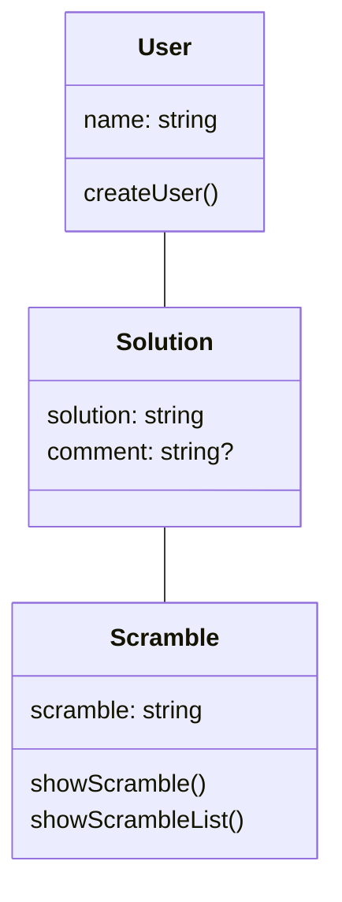
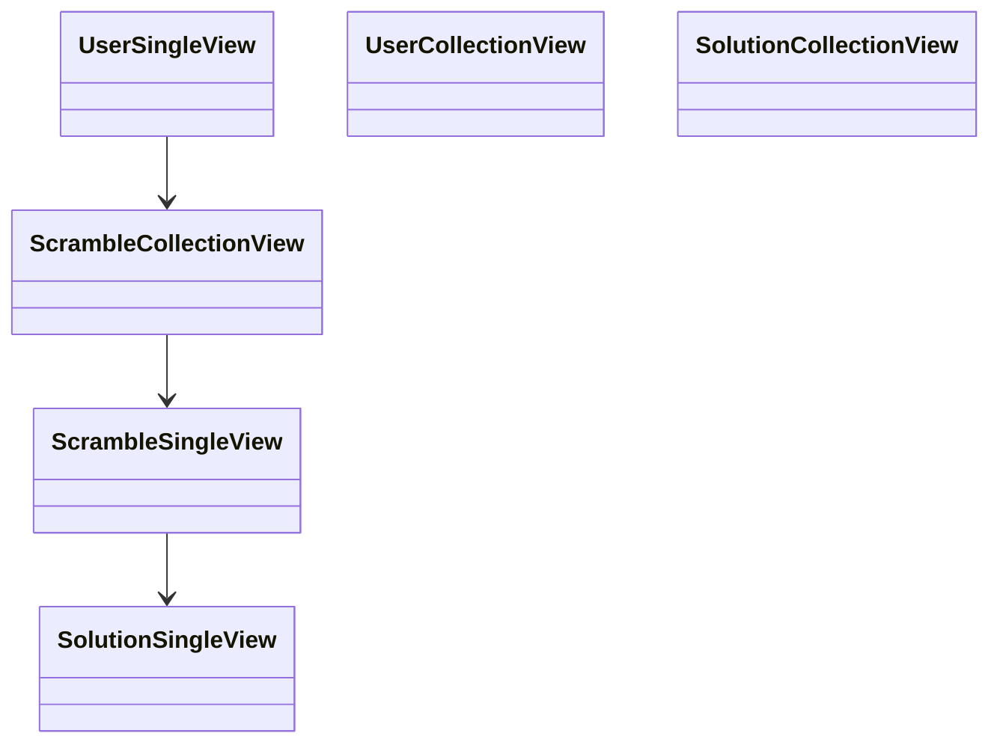
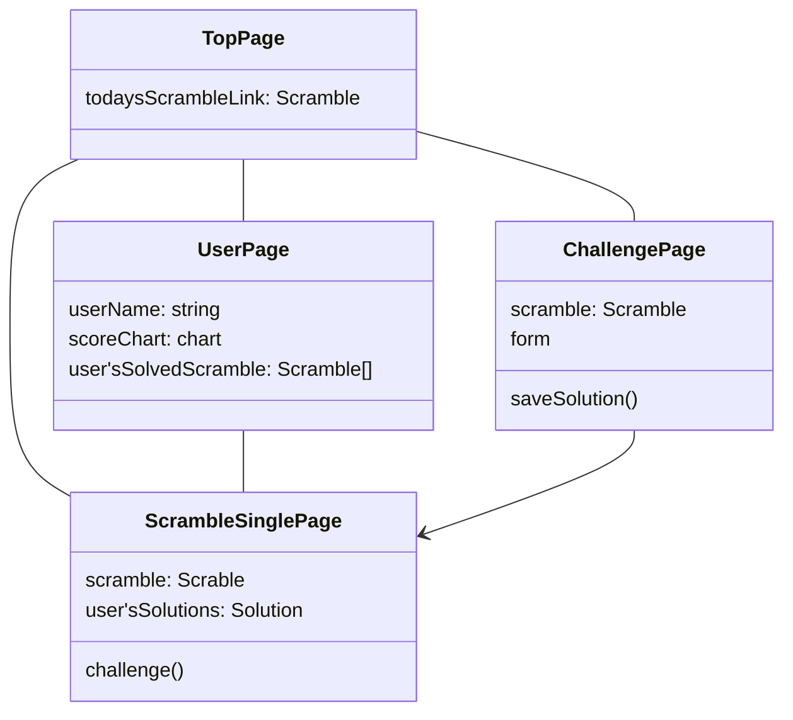

# UX v1.0

Organize the experience to be implemented at https://github.com/sKawashima/fmc-logger/milestone/1 and the objects and UI based on it.

## Personal experience

At a minimum, define what you want to use on a daily basis.
Elements related to community, etc. will be considered after v2.

- User registration is available.
- Scrambles are generated on a daily basis
- All users can see the same scramble
- Users can record their answers
- Users can review their answers
- Users can see their scores and how they have changed

## Objects (for OOUI)

### Object Views

I will not consider Views that relate to others, such as UserCollectionView and SolutionCollectionView, because I do not deal with community-related experiences.

## Pages

