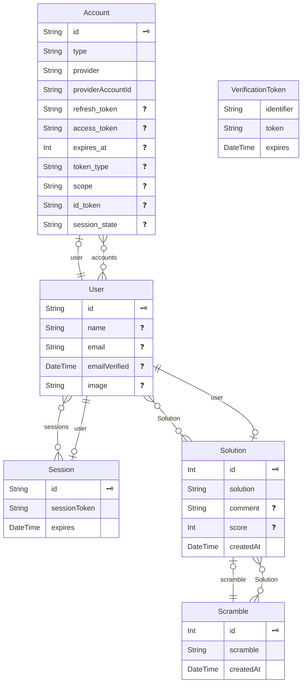

```mermaid
erDiagram

  "Account" {
    String id "🗝️"
    String type
    String provider
    String providerAccountId
    String refresh_token "❓"
    String access_token "❓"
    Int expires_at "❓"
    String token_type "❓"
    String scope "❓"
    String id_token "❓"
    String session_state "❓"
    }


  "Session" {
    String id "🗝️"
    String sessionToken
    DateTime expires
    }


  "User" {
    String id "🗝️"
    String name "❓"
    String email "❓"
    DateTime emailVerified "❓"
    String image "❓"
    }


  "VerificationToken" {
    String identifier
    String token
    DateTime expires
    }


  "Scramble" {
    Int id "🗝️"
    String scramble
    DateTime createdAt
    }


  "Solution" {
    Int id "🗝️"
    String solution
    String comment "❓"
    Int score "❓"
    DateTime createdAt
    }

    "Account" o|--|| "User" : "user"
    "Session" o|--|| "User" : "user"
    "User" o{--}o "Account" : "accounts"
    "User" o{--}o "Session" : "sessions"
    "User" o{--}o "Solution" : "Solution"
    "Scramble" o{--}o "Solution" : "Solution"
    "Solution" o|--|| "Scramble" : "scramble"
    "Solution" o|--|| "User" : "user"
```
